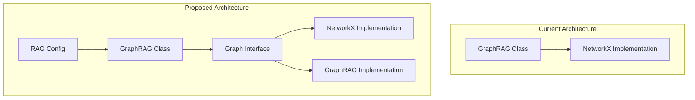

# GraphRAG Implementation Plan

## Overview

This document outlines the plan to add GraphRAG as an alternative to NetworkX for the graph RAG functionality in the Doogie Chat Bot. GraphRAG is a specialized graph library optimized for RAG operations with better memory efficiency and performance than NetworkX, particularly for large knowledge graphs.

## 1. System Architecture Changes

## 2. Implementation Plan

### Phase 1: Create Abstraction Layer

1. **Create a Graph Interface**
   - Define an abstract base class that both NetworkX and GraphRAG implementations will implement
   - Include all necessary methods currently used in the GraphRAG class
   - Ensure the interface is comprehensive enough to support both implementations

2. **Refactor Current NetworkX Implementation**
   - Move the current NetworkX implementation into a concrete class that implements the graph interface
   - Ensure all functionality is preserved
   - Add unit tests to verify the refactored implementation works correctly

### Phase 2: Add GraphRAG Implementation

1. **Implement GraphRAG Adapter**
   - Create a new class that implements the graph interface using the GraphRAG library
   - Ensure all methods have equivalent functionality to the NetworkX implementation
   - Handle any API differences between NetworkX and GraphRAG
   - Add comprehensive error handling and logging

2. **Add GraphRAG Dependencies**
   - Update requirements.txt to include the GraphRAG library
   - Update Dockerfile to install any necessary dependencies
   - Document the new dependency in the project documentation

### Phase 3: Update Configuration System

1. **Extend RAG Configuration Model**
   - Add a new field to the RAGConfig model to store the graph implementation choice
   - Update the database schema with a migration
   - Set NetworkX as the default for backward compatibility

2. **Update RAG Configuration Service**
   - Add methods to get and set the graph implementation
   - Ensure backward compatibility for existing configurations

### Phase 4: Update Factory and Singleton

1. **Update RAG Singleton**
   - Modify the singleton to create the appropriate graph implementation based on configuration
   - Ensure thread safety during initialization
   - Add proper error handling for missing implementations

2. **Update GraphRAG Class Constructor**
   - Modify the GraphRAG class to accept an implementation parameter
   - Initialize the appropriate graph implementation based on the parameter

### Phase 5: Update API and Routes

1. **Add New API Endpoint**
   - Create a new endpoint to update the graph implementation
   - Add validation for the implementation parameter
   - Ensure only admins can change this setting

2. **Update Status Endpoint**
   - Modify the status endpoint to include the current graph implementation
   - Add performance metrics if available

### Phase 6: Update Frontend

1. **Update RAG Configuration UI**
   - Add a new section to the RAG configuration page for selecting the graph implementation
   - Include information about the pros and cons of each implementation
   - Add a confirmation dialog when changing implementations

2. **Update API Service**
   - Add a new method to the RAG service for updating the graph implementation
   - Handle errors and provide user feedback

## 3. Testing Strategy

1. **Unit Tests**
   - Test the graph interface implementations for both NetworkX and GraphRAG
   - Verify that both implementations produce equivalent results for the same inputs
   - Test edge cases and error handling

2. **Integration Tests**
   - Test the configuration system with both implementations
   - Verify that the system can switch between implementations
   - Test the API endpoints for updating the implementation

3. **Performance Tests**
   - Compare the performance of NetworkX and GraphRAG for various graph sizes
   - Measure memory usage, query time, and build time
   - Document the results for user reference

## 4. Documentation Updates

1. **User Documentation**
   - Add information about the available graph implementations
   - Provide guidance on when to use each implementation
   - Document any differences in behavior or performance

2. **Developer Documentation**
   - Document the graph interface and implementations
   - Provide examples of extending the system with new graph implementations
   - Update architecture diagrams to reflect the new design

## 5. Migration Plan

1. **Database Migration**
   - Create an Alembic migration for the new graph_implementation field
   - Set the default value to "networkx" for backward compatibility

2. **Code Deployment**
   - Deploy the changes in phases to minimize risk
   - Monitor system performance and stability after each phase
   - Have a rollback plan in case of issues

## 6. Timeline and Resources

1. **Estimated Timeline**
   - Phase 1 (Abstraction Layer): 1-2 weeks
   - Phase 2 (GraphRAG Implementation): 2-3 weeks
   - Phase 3-4 (Configuration Updates): 1 week
   - Phase 5-6 (API and Frontend): 1-2 weeks
   - Testing and Documentation: 1-2 weeks
   - Total: 6-10 weeks

2. **Required Resources**
   - Backend developer familiar with Python, FastAPI, and graph algorithms
   - Frontend developer familiar with React and Next.js
   - DevOps support for deployment and monitoring
   - QA resources for testing

## 7. Risks and Mitigations

1. **Compatibility Risks**
   - Risk: GraphRAG API may not map cleanly to all NetworkX functions
   - Mitigation: Create adapter functions or fallback to NetworkX for unsupported operations

2. **Performance Risks**
   - Risk: GraphRAG may not perform better in all scenarios
   - Mitigation: Add benchmarking tools and guidance on when to use each implementation

3. **Stability Risks**
   - Risk: Introducing a new library could cause system instability
   - Mitigation: Extensive testing and phased rollout

4. **Migration Risks**
   - Risk: Existing graphs may not be compatible with the new implementation
   - Mitigation: Add conversion utilities and maintain backward compatibility