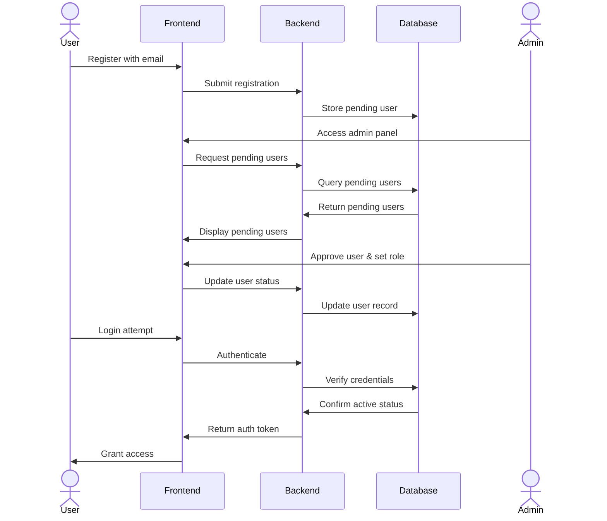
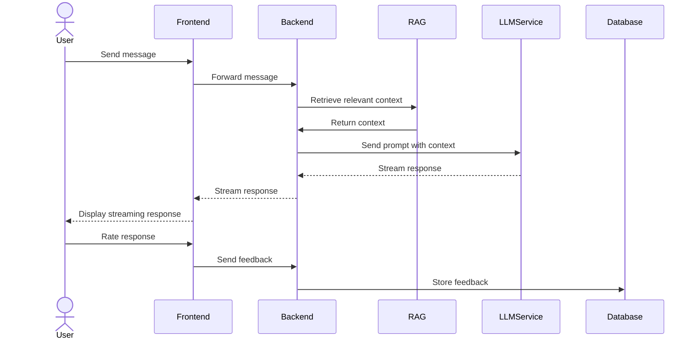

# System Patterns

## System Architecture

```mermaid
flowchart TD
    User[User Browser] <--> FE[Frontend: Next.js/React]
    FE <--> BE[Backend: FastAPI]
    BE <--> DB[(Database: SQLite3)]
    BE <--> RAG[Hybrid RAG System]
    BE <--> LLM[External LLM Services]
    
    subgraph RAG System
        BM25[BM25 Index]
        FAISS[FAISS Vector Store]
        GraphRAG[Graph RAG]
        
        BM25 <--> Retriever
        FAISS <--> Retriever
        GraphRAG <--> Retriever
    end
    
    subgraph External Services
        Ollama[Ollama]
        LMStudio[LM Studio]
        OpenAI[OpenAI]
        OpenRouter[OpenRouter]
        Deepseek[Deepseek]
        Anthropic[Anthropic]
    end
    
    LLM --- External Services
```

## Key Technical Decisions

1. **Single Container Deployment**
   - All components (frontend, backend, database) run in a single Docker container
   - Simplifies deployment and development
   - Auto-reload for both frontend and backend during development

2. **Hybrid RAG Approach**
   - Combines BM25 (keyword-based) and FAISS (vector-based) for comprehensive retrieval
   - GraphRAG for relationship-aware information retrieval
   - Support for multiple document formats

3. **External LLM Integration**
   - No local LLM hosting
   - Flexible provider selection through admin interface
   - Support for both chat and embedding models

4. **Database Design**
   - SQLite3 for simplicity and portability
   - Schema supports user management, chat history, and document metadata

5. **API-First Backend**
    - FastAPI for high-performance, type-safe API development
    - Frontend proxies all requests to backend through Next.js rewrites
    - Consistent URL handling with /api prefix for regular requests
    - Clear separation of concerns

6. **Streaming Response Pattern**
    - Real-time streaming of LLM responses using EventSource
    - Two authentication methods supported:
      - Regular API calls use Authorization header
      - Streaming endpoints accept token via query parameter
    - Proxy-aware URL handling for consistent routing
    - Improves perceived performance and user experience

## Component Relationships

### User Authentication Flow



### Chat Processing Flow



## Design Patterns

1. **Repository Pattern**
   - Abstract database operations
   - Separate data access from business logic

2. **Dependency Injection**
   - Flexible configuration of services
   - Easier testing and component replacement

3. **Factory Pattern**
   - Dynamic creation of LLM clients based on configuration
   - Consistent interface across different providers

4. **Observer Pattern**
   - Event-based notifications for system events
   - Used for streaming responses and real-time updates

5. **Strategy Pattern**
   - Interchangeable RAG strategies
   - Configurable retrieval methods

## User Authentication and Authorization

1. **User Model**
   - Users have unique string IDs
   - Email addresses used as usernames
   - Role-based access control (user/admin)
   - Status tracking (pending/active/inactive)
   - New users start with 'pending' status requiring admin approval

2. **Authentication Flow**
   - JWT-based authentication
   - Token stored in localStorage
   - Admin-only routes protected by withAdmin HOC
   - Specific error messages for different account statuses:
     - Pending accounts: "Your account is pending approval by an administrator"
     - Inactive accounts: "Your account has been deactivated"
   - Registration confirmation with admin approval notification
   - Robust error handling for API responses:
     - Proper extraction of FastAPI error details
     - User-friendly error messages displayed to users